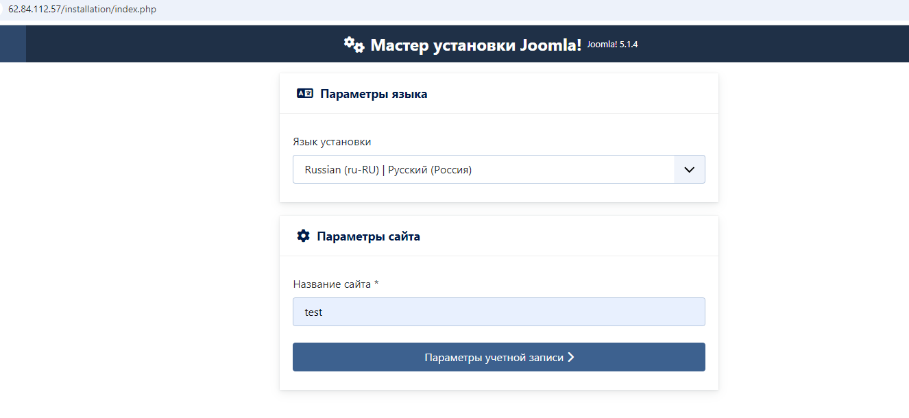
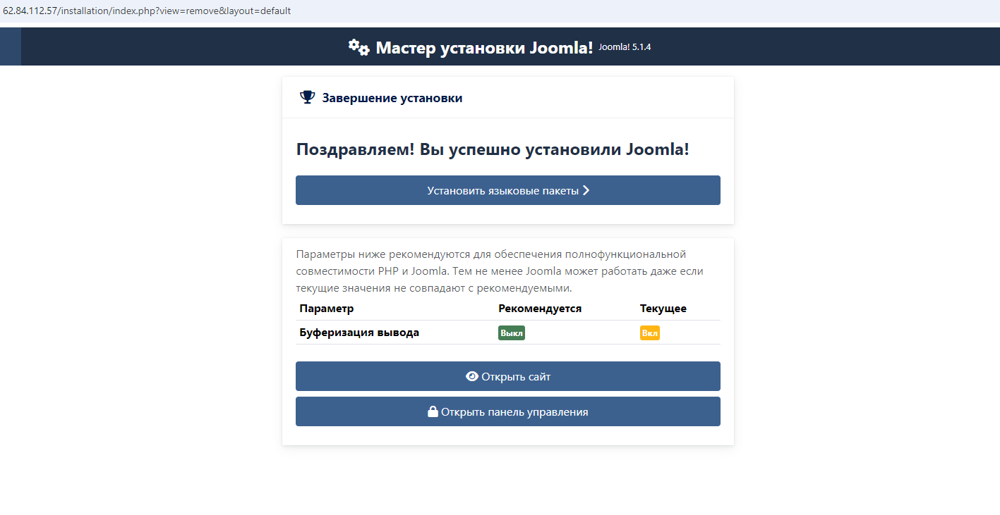

### Playbook site.yml устанавливает nginx, php 8.1, mariadb-server и cms joomla
#### Для запуска 
```bash
ansible-playbook -i inventory.yaml site.yml --vault-password-file password.txt
```  

#### Настройка самой Joomla  

Указываем название сайта:  

  

Заполняем учетные данные и создаем пароль администратора:

  

Меняем тип базы данных с MysqlLi на Mysql PDO. Заполняем учетные данные из нашего задания.


Все CMS Joomla установлена корректно

